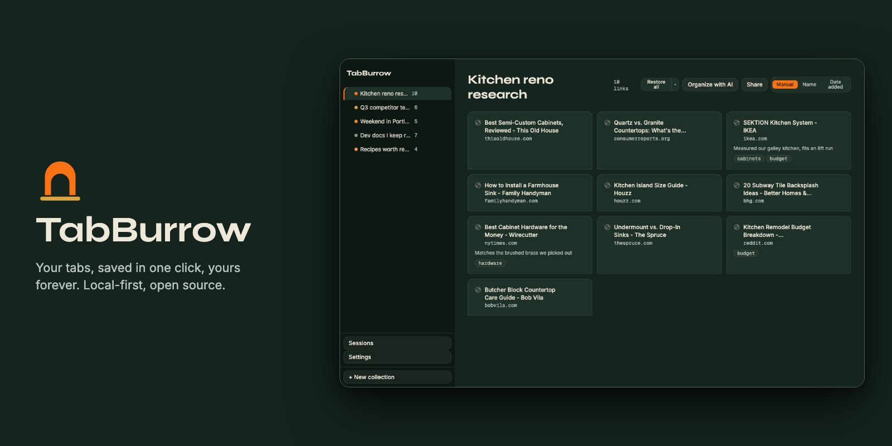

# TabBurrow

**Your tabs, saved in one click, yours forever. No account required. Free on-device AI organizing, with cloud sync and sharing when you want them.**

[](https://github.com/lbwalton/tabburrow/actions/workflows/ci.yml)
[](https://github.com/lbwalton/tabburrow/blob/main/LICENSE)
[](#project-status)

TabBurrow is an open-source, local-first tab and bookmark manager for Chrome.
One click saves a tab, a selection of tabs, or a whole window into a
collection; everything works instantly with zero signup, and nothing leaves
your device unless you choose to sign in. On a capable desktop Chrome, AI
organizing runs on-device with Chrome's built-in Gemini Nano, free, private,
no key. Sign in later for cloud sync, cloud AI, and shareable collection
pages.


## Why TabBurrow

- **Local-first, no forced account.** Every save, organize, and restore
  action works instantly on a fresh install. Data lives in your browser's
  IndexedDB; nothing is required to sign up, and nothing syncs anywhere
  unless you opt in.
- **AI auto-organize, with a preview.** One click groups and tags your
  tabs into collections, and you approve the exact diff before anything
  changes; nothing is ever applied automatically. On a capable desktop
  Chrome it runs on-device (Chrome's built-in Gemini Nano): free, and
  nothing leaves your browser. The cloud path (Claude) covers any device
  and sends only titles and URLs, never page content.
- **Open source, AGPL-3.0.** Every line is public: the popup, the
  dashboard, the sync engine, the AI organize function. Audit it, fork
  it, or [self-host](SELF_HOSTING.md) the whole stack on your own
  infrastructure.
- **Distinctive editorial design.** The tab-manager category is uniformly
  white/gray SaaS. TabBurrow isn't: Deep Green ground, warm orange
  accent, editorial type, a burrow motif throughout.

## Free vs PRO vs Self-host

| Feature | Free | PRO | Self-host |
| --- | --- | --- | --- |
| Local saving & collections | Unlimited, forever | Unlimited | Unlimited |
| Drag-and-drop organizing | Yes | Yes | Yes |
| Sessions & crash restore | Yes | Yes | Yes |
| Search, import & export | Yes | Yes | Yes |
| Cloud sync across devices | No | Yes | Yes (your Supabase) |
| Shareable collection pages | No | Yes | Yes (your Supabase) |
| AI organize, on-device (Gemini Nano) | Free, unlimited* | Free, unlimited* | Free, unlimited* |
| AI organize, cloud (Claude) | 30 runs/month | Unlimited (fair use) | Your Anthropic key |
| Price | $0 | $3.99/mo or $29/yr | $0 to us |

\* On-device AI needs a Chrome that can run Gemini Nano (roughly Chrome
138+, a decent GPU or 16 GB RAM, and ~22 GB free disk). Everything else in
the Free column has no hardware caveat.

## Quickstart

**Install from the Chrome Web Store**: coming soon.

**Build from source:**

```sh
git clone https://github.com/lbwalton/tabburrow.git
cd tabburrow
pnpm install
pnpm --filter extension build
```

Then load it unpacked:

1. Open `chrome://extensions`
2. Enable **Developer mode** (top right)
3. Click **Load unpacked**
4. Select `apps/extension/.output/chrome-mv3`

Requires Node 22+ and pnpm 11 (via corepack; the repo pins
`packageManager`). No environment variables are needed for a local build; see [SELF_HOSTING.md](SELF_HOSTING.md) if you also want
cloud sync, AI organize, and sharing running against your own Supabase
project.

## Architecture

Monorepo (pnpm workspaces):

```
tabburrow/
├── apps/
│   ├── extension/       # WXT + React + TypeScript + Tailwind (Manifest V3)
│   │   ├── entrypoints/
│   │   │   ├── popup/       # quick save + quick access
│   │   │   ├── dashboard/   # full-page management UI (own tab)
│   │   │   └── background.ts # service worker: sync engine, session snapshots
│   │   └── lib/          # pure logic, unit tested
│   └── web/              # Next.js (App Router) on Vercel: marketing site,
│       ├── (marketing)/  #   share pages (s/[slug]), account/billing entry
│       ├── s/[slug]/
│       └── account/
├── packages/
│   ├── core/              # shared types, storage schema, sync + merge logic
│   └── ui/                # design tokens + shared React components
├── supabase/
│   ├── migrations/        # Postgres schema + RLS policies
│   └── functions/         # Edge Functions: ai-organize, checkout-session,
│                           #   stripe-webhook
├── docs/                   # specs, plans, self-hosting guide
└── stories/                 # implementation stories + fix stories (bug bash)
```

`extension` and `web` both depend on `core` (data model, sync, merge logic)
and `ui` (design tokens + components) as workspace packages; there is one
source of truth for both, not two implementations.

## Self-hosting & contributing

- [SELF_HOSTING.md](SELF_HOSTING.md): run your own Supabase project, deploy
  the Edge Functions, and build the extension against your own keys.
- [CONTRIBUTING.md](CONTRIBUTING.md): dev setup, test commands, commit
  conventions, and PR expectations.

## Project status

TabBurrow is built in the open, one story at a time; every commit maps to
a story in [`stories/stories.json`](stories/stories.json), each with its
own acceptance criteria.

**v1.0 is feature-complete and live-tested:** the full local extension
(popup hub, dashboard with drag-and-drop, sessions and crash restore,
fuzzy search, import/export, keyboard shortcuts), on-device AI organizing
via Chrome's built-in Gemini Nano, and the full cloud layer (auth with
email codes and Google, cross-device sync, cloud AI organize, share
pages, and Stripe billing), verified by 560+ unit tests and an end-to-end
suite that drives the real built extension in Chrome, including a live
Stripe test checkout and a live AI organize.

**Now:** the Chrome Web Store listing is being prepared for review. Until
it's live, install by building from source (above).

No fake stars, no fake user counts, no testimonials here. Watch the repo
or check `stories/stories.json` for real, current progress.

## License

[AGPL-3.0](LICENSE). Forks that host TabBurrow as a service must publish
their changes; that's the deal that keeps this genuinely open source
while protecting the hosted TabBurrow business.
